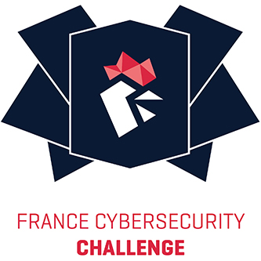
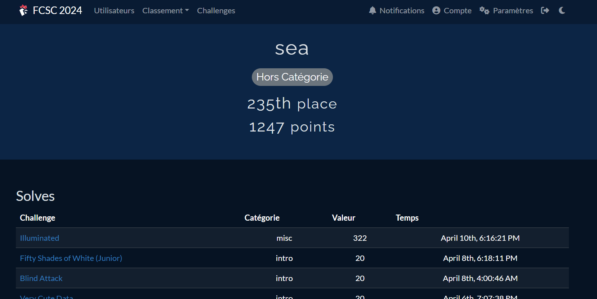
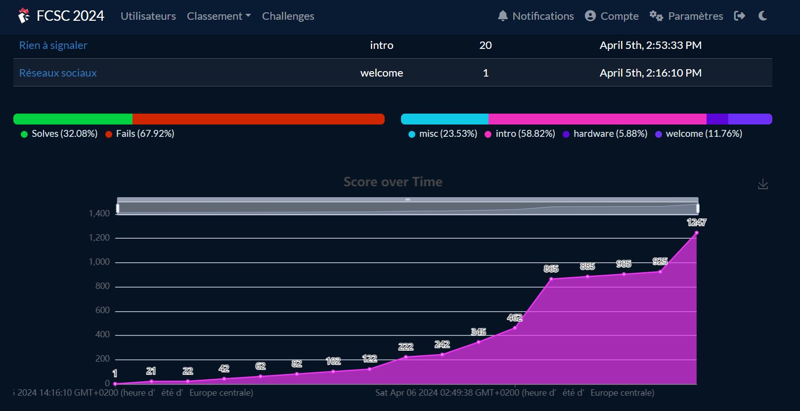

# FCSC2024_WRITEUPS

  

For several years, France has participated in the European Cybersecurity Challenge (ECSC), a European competition, which opposes around twenty national teams made up of young ethical hackers, aged 14 to 25. In order to identify and select the best French players, ANSSI organizes the France Cybersecurity Challenge (FCSC).

Having participated for the third consecutive time, I joined the ranks of the 2024 FCSC edition, held from April 5th to April 14th. Renowned for its meticulous organization and robust infrastructure, FCSC stands out as one of the premier Capture The Flag (CTF) events. Additionally, the vibrant community present on the competition's Discord server fosters collaboration and camaraderie among participants.

Here, you'll find detailed write-ups of some of the challenges I successfully tackled. I'm particularly pleased with the progress I've made in my ranking over the years in an area that I'm still exploring.

| Participant        | User Name           | Ranking  |
| ------------- |:-------------:| -----:|
| ALABOUCH Salah-Eddine      | sea | 235/1434 |

Here's to the next year ❤️