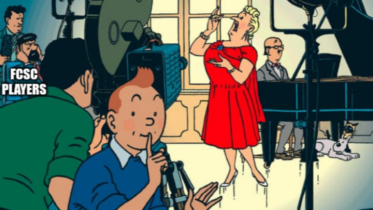
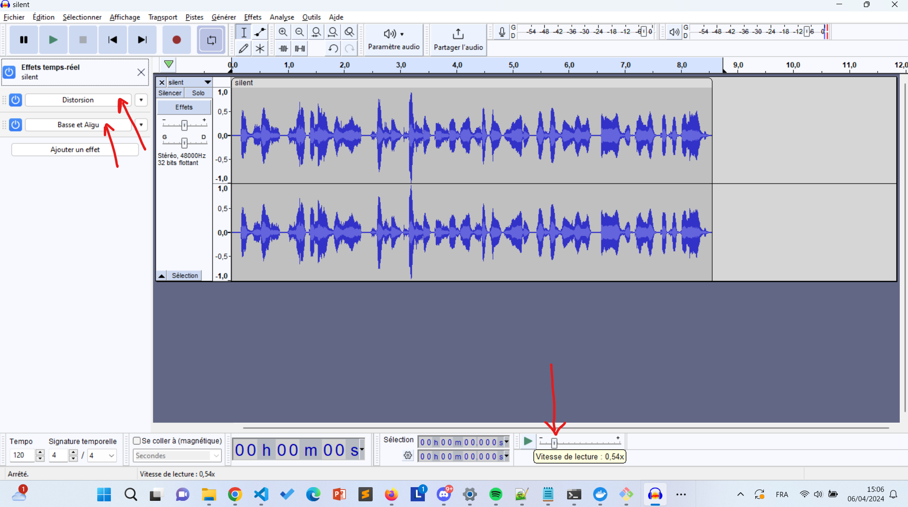
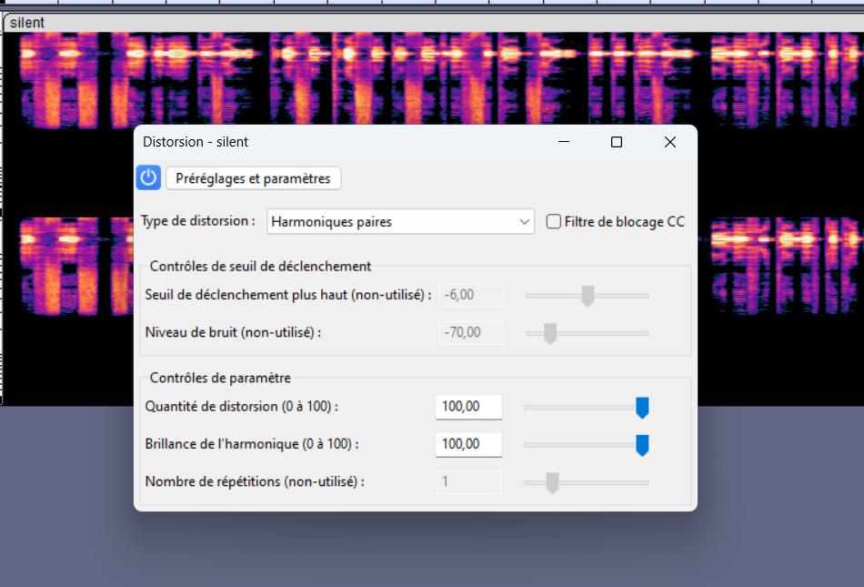
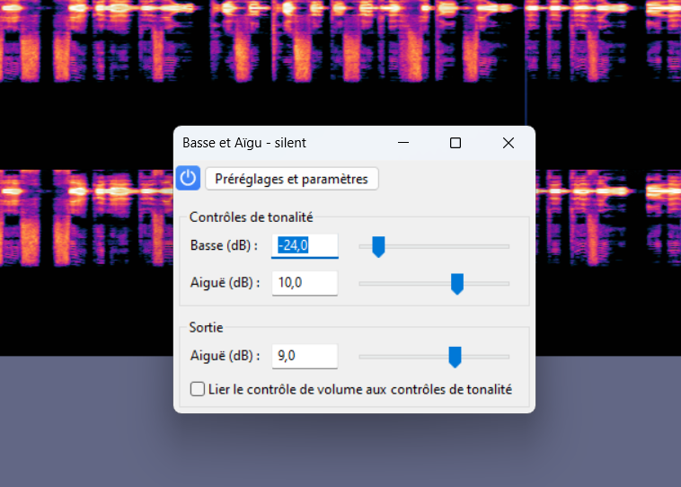

# Castafiore

## Challenge Overview
- **Original French description:** Depuis peu, votre téléphone réagit à des commandes vocales inconnues, mais vous n'entendez rien. A partir d'un enregistrement audio, comprenez pourquoi. Format du flag : FCSC{[0-9]+}
- **Translated Description :** Lately, your phone has been responding to unknown voice commands, but you don't hear anything. From an audio recording, understand why. Flag format: FCSC{[0-9]+}

  

## Solution
Audio forensics challenges often require careful analysis and manipulation of audio files to uncover hidden information.

1. **Software Used:** Audacity

2. **Real-Time Effects Applied:** Distortion and Equalization (Bass and Treble Boost). Set the harmonic pairs distortion to 100. Set Bass to -24 dB. Set treble to 10 dB.

3. **Playback Speed Adjustment:** Played the audio file at a speed between 0.3x and 0.5x.

4. **Result:** By carefully listening to the distorted audio at the adjusted playback speed, the numbers of the flag become discernible.

5. **Audio after editing :**

  <audio controls>
    <source src="audio/edited_audio.wav" type="audio/wav">
    Your browser does not support the audio element.
  </audio>

6. **Flag :** FCSC{2035351597102220198194}

7. **Screenshots:**

  

  

  

