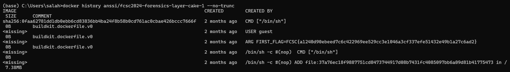

# Layer Cake 1/3

## Challenge Overview
- **Points:** 20
- **Original French description:** Un développeur de GoodCorp souhaite publier une nouvelle image Docker. Il utilise une variable d'environnement stockant un flag au moment du build, et vous assure que ce secret n'est pas visible du public. L'image est anssi/fcsc2024-forensics-layer-cake-1.
- **Translated Description :** A GoodCorp developer wants to publish a new Docker image. They use an environment variable to store a flag during the build process and assure you that this secret is not visible to the public. The image is anssi/fcsc2024-forensics-layer-cake-1.


## Solution

```bash
  # Run the Docker image
  docker run -it anssi/fcsc2024-forensics-layer-cake-1

  # View the history of the Docker image without truncating the output
  docker history anssi/fcsc2024-forensics-layer-cake-1 --no-trunc
  
```

The flag should appear in the docker history

[](images/1.png)

- **Flag:** 
FCSC{a1240d90ebeed7c6c422969ee529cc3e1046a3cf337efe51432e49b1a27c6ad2}
