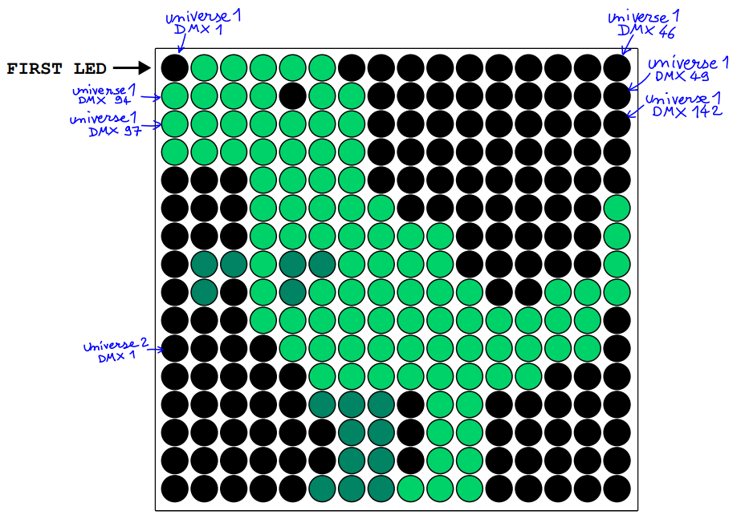

# Illuminated

## Challenge Overview
- **Original French description:** Une éclairagiste vous met au défi de reconstituer une animation d'un écran vidéo stockée sur son enregistreur DMX. Vous réalisez alors une capture réseau (capture.pcap) en vous branchant en Ethernet sur son enregistreur. Pour vous aider, elle vous donne un extrait annoté de la documentation de son écran vidéo (cheatsheet.pdf).  Releverez-vous le défi ?

- **Translated Description :** An lighting technician challenges you to recreate an animation from a video screen stored on her DMX recorder. You then perform a network capture (capture.pcap) by connecting via Ethernet to her recorder. To assist you, she provides you with an annotated excerpt from the documentation of her video screen (cheatsheet.pdf). Will you rise to the challenge?

  

## Solution

Here are the big steps to solve this problem.

The first thing is to parse the capture.pcap file. For that you can use a library like : scapy

For me, I chose to export the pcap file to .txt file using Wireshark, then parsing it using some split strategies (this is not the best way to handle this problem. Use scapy if you are used to it)

The data that interest us in this problem is : dmx_channels from which we can extract the color code for Red, Green and Blue channels.

Reading the cheatsheet.pdf, we can notice that we have two universes : Universe 1 and Universe 2

The leds are following a snake like order. With a step of 3.

We also have a time attribute, that can help us sort the data.

We can notice that sometimes we have some 'FL' values. Since I should have only integer values I replaced 'FL' occurences by 255.

See the notebook : Illuminated.ipynb for code

**Flag**: FCSC{L1ghtD3sign3rCr-gg!}