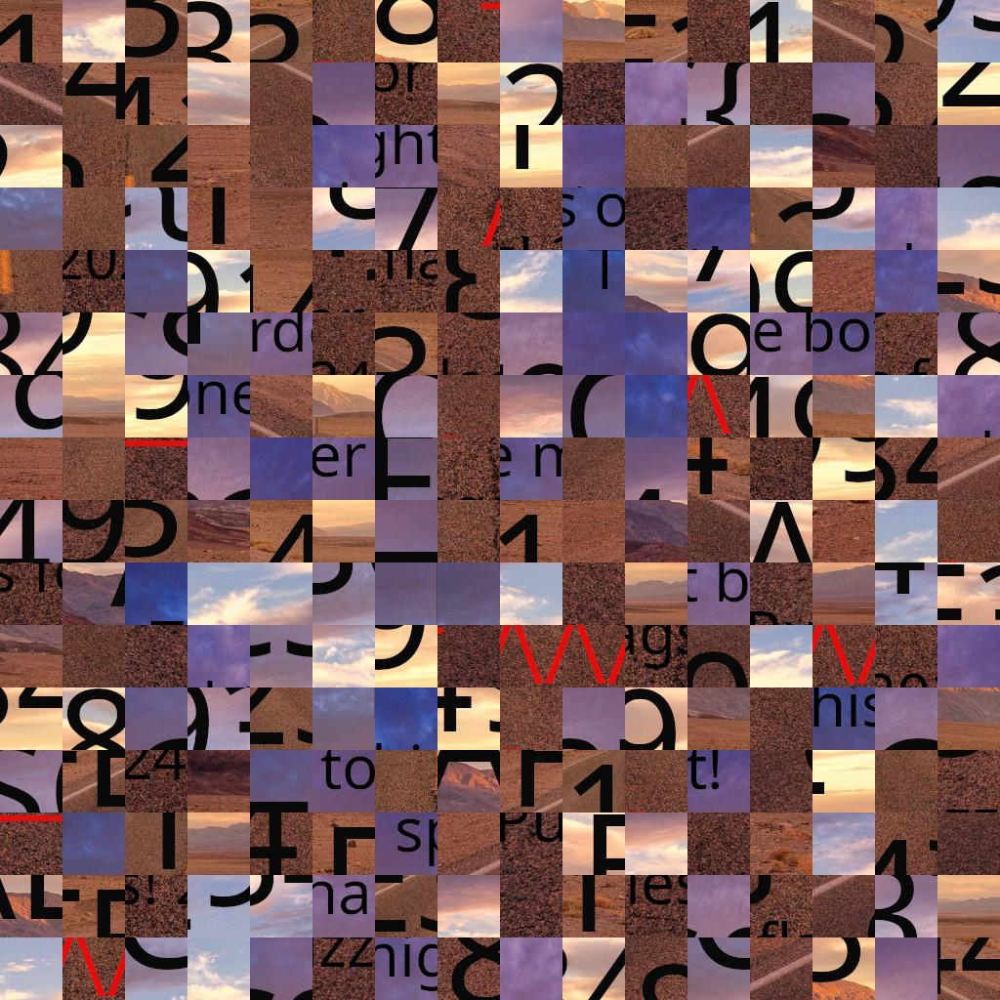
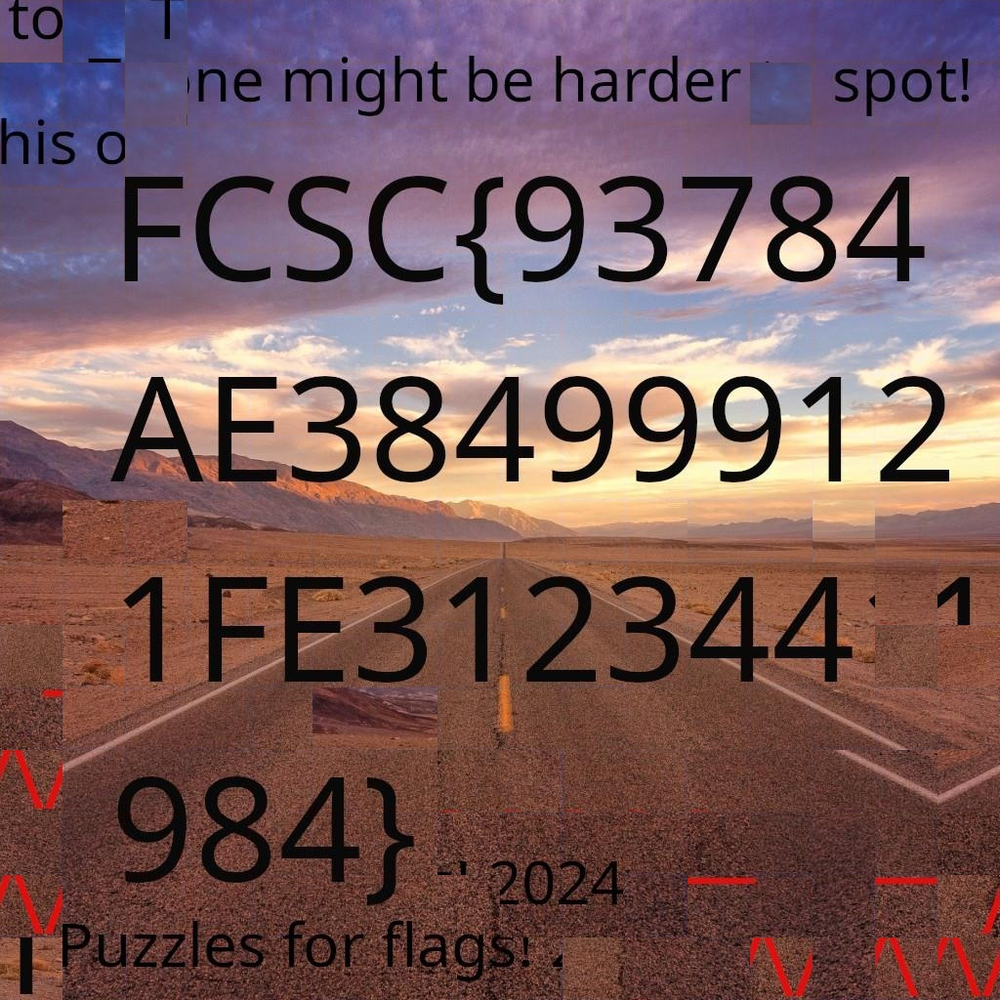

# Puzzle Trouble 1/2

## Challenge Overview
- **Original French description:** On vous demande de retrouver le flag dans ce bazar de tuiles ! Il paraît qu'elles n'ont pas été retournées...

- **Translated Description :** You are asked to find the flag in this mess of tiles! It seems they haven't been flipped...

<div align="center">
  <a href="images/puzzle-trouble-hard.jpg"></a>
</div>


## Solution

One approach is to use image processing libraries like OpenCV or PIL to detect rectangles based on border color similarity. You can iterate through the image pixels, identify contiguous regions with similar colors, and then fit rectangles around them. 


Alternatively, you can leverage existing tools like the GitHub project [gaps](https://github.com/nemanja-m/gaps) (Genetic Algorithm based solver for jigsaw puzzles). This tool automates the process of solving jigsaw puzzles by employing genetic algorithms and automatically detecting piece sizes.

We can clone this repository and install its requirements

Since we have an 1024x1024 image with 16 rectangle lines and 16 rectangles columns so each rectangle is 64x64

```bash
git clone https://github.com/nemanja-m/gaps.git

cd gaps

!pip install .

# You should copy the puzzle image into gaps folder
!gaps run puzzle-trouble-hard.jpg solution.jpg --generations=20 --population=600 --size=64
```


<div align="center">
  <a href="images/puzzle-trouble-easy-solution.jpg"></a>
</div>

You only have to rewrite the flag and submit it.